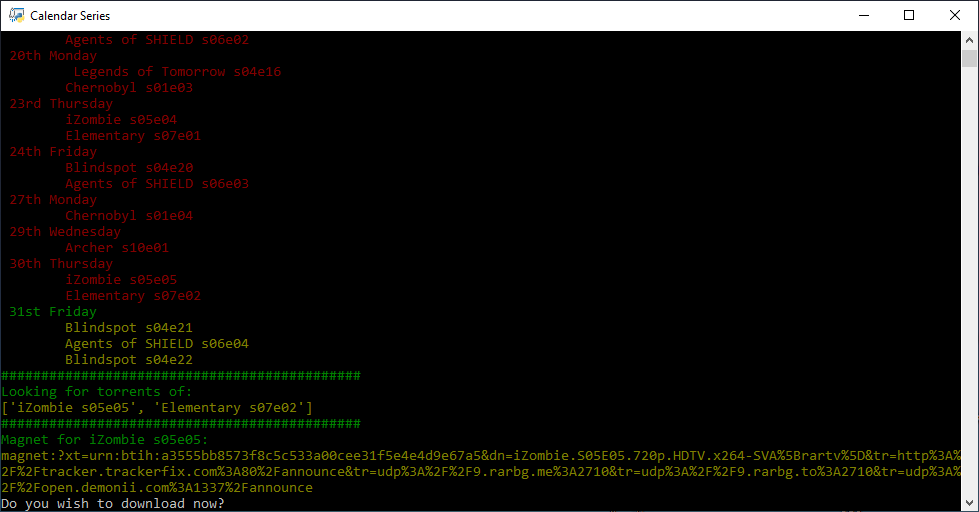

# CalendarShows

Simple Python Script that parses a TV Show Calendar site then Checks for TV Shows episodes that I watch and retrieves Torrent links from an external API.

# What I Learned

* How to Crawl webpages using requests and BeautifulSoup4 to parse HTML and retrieve information
* Consume an API to retrieve information using previous gathered info to retrieve torrent magnet link
* That I saved a shit ton of time by doing this script

# Sample Image

